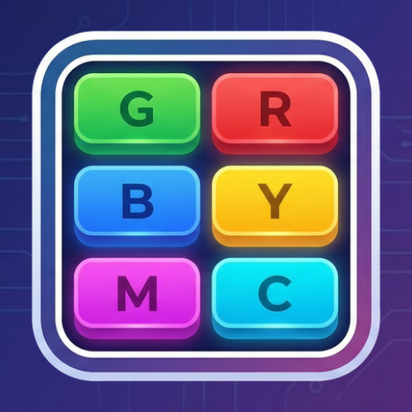

    

# Simon game

A prototype of Simon game that save sequences when click on buttons, if app is closed the saving disappear

---

## Testing

I have tested the app on physical device Samsung S25 with android 16 (Api level 36.0), and on a pixel 9 emulator with android 16 (Api level 36.1)

### Emulator properties

> | Property                         | Value                                |     | Property                  | Value                                          |
> |----------------------------------|--------------------------------------|-----|---------------------------|------------------------------------------------|
> | avd.ini.displayname              | Pixel 9                              |     | hw.lcd.density            | 420                                            |
> | avd.ini.encoding                 | UTF-8                                |     | hw.lcd.height             | 2424                                           |
> | AvdId                            | Pixel_9                              |     | hw.lcd.width              | 1080                                           |
> | disk.dataPartition.size          | 6G                                   |     | hw.mainKeys               | no                                             |
> | fastboot.chosenSnapshotFile      |                                      |     | hw.ramSize                | 2048                                           |
> | fastboot.forceChosenSnapshotBoot | no                                   |     | hw.sdCard                 | yes                                            |
> | fastboot.forceColdBoot           | no                                   |     | hw.sensors.light          | yes                                            |
> | fastboot.forceFastBoot           | yes                                  |     | hw.sensors.magnetic_field | yes                                            |
> | hw.accelerometer                 | yes                                  |     | hw.sensors.orientation    | yes                                            |
> | hw.arc                           | false                                |     | hw.sensors.pressure       | yes                                            |
> | hw.audioInput                    | yes                                  |     | hw.sensors.proximity      | yes                                            |
> | hw.battery                       | yes                                  |     | hw.trackBall              | no                                             |
> | hw.camera.back                   | virtualscene                         |     | image.sysdir.1            | system-images\android-36.1\google_apis\x86_64\ |
> | hw.camera.front                  | emulated                             |     | PlayStore.enabled         | false                                          |
> | hw.cpu.ncore                     | 4                                    |     | runtime.network.latency   | none                                           |
> | hw.device.hash2                  | MD5:5478e3411cc0e0441240e736eb14c07a |     | runtime.network.speed     | full                                           |
> | hw.device.manufacturer           | Google                               |     | showDeviceFrame           | yes                                            |
> | hw.device.name                   | pixel_9                              |     | skin.dynamic              | yes                                            |
> | hw.dPad                          | no                                   |     | tag.display               | Google APIs                                    |
> | hw.gps                           | yes                                  |     | tag.display               | Google APIs                                    |
> | hw.gpu.enabled                   | yes                                  |     | tag.id                    | google_apis                                    |
> | hw.gpu.mode                      | auto                                 |     | tag.ids                   | google_apis                                    |
> | hw.gyroscope                     | yes                                  |     | target                    | android-36.1                                   |
> | hw.initialOrientation            | portrait                             |     | vm.heapSize               | 228                                            |
> | hw.keyboard                      | yes                                  |     |                           |                                                |

## Development information

I used official android documentation especially [Compose components](https://kotlinlang.org/api/compose-multiplatform/material3/androidx.compose.material3/) documentation site and [list/grid](https://developer.android.com/develop/ui/compose/lists) ui documentation. In addition, I used some You tube video ([Navigation](https://www.youtube.com/watch?v=4gUeyNkGE3g&t=931s), [Nested scrolling](https://www.youtube.com/watch?v=Y547UHx5Rc0))
